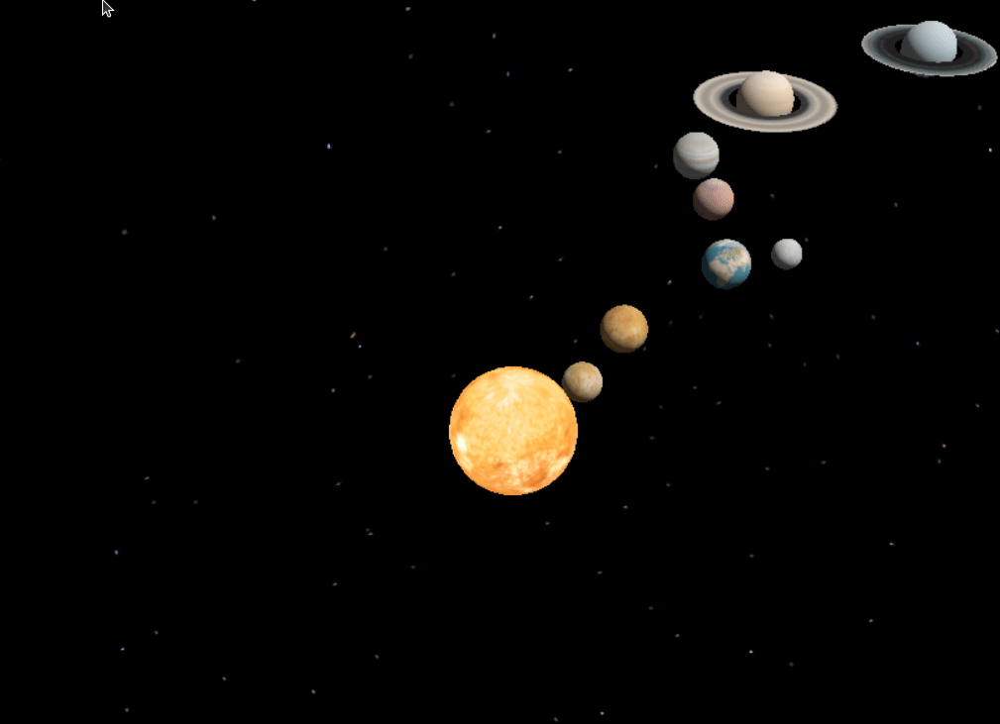

<p align="center">
  <a href="#-tecnologias">Tecnologias</a>&nbsp;&nbsp;&nbsp;|&nbsp;&nbsp;&nbsp;
  <a href="#-projeto">Projeto</a>&nbsp;&nbsp;&nbsp;|&nbsp;&nbsp;&nbsp;
  <a href="#-layout">Layout</a>&nbsp;&nbsp;&nbsp;|&nbsp;&nbsp;&nbsp;
  <a href="#memo-licença">Licença</a>
</p>

<p align="center">
 

  
</p>

<br>

<p align="center">
  
</p>

## 🚀 Tecnologias

Esse projeto foi desenvolvido com as seguintes tecnologias:

- JavaScript
- CSS
- Three.js
- Yarn
- Netlify

## 💻 Projeto

Esse projeto foi feito com intuito de praticar o uso da biblioteca Three.js. O projeto é um sistema solar interativo o qual o usuário pode interagir com os elementos presentes do sistema solar e obter alguns dados referentes a determinado elemento(estrela, planeta, satélite natural).


Foi feito o deploy do site desenvolvido utilizando a plataforma Netlify, você pode acessar através [desse link](https://65a8129953acab18ee74b9cd--creative-strudel-af9952.netlify.app/)

## 👨‍💻 Como-rodar-o-projeto

Você precisa ter o <strong>Node.js</strong> instalado na sua máquina. Senão tiver você pode fazer o download através [desse link](https://nodejs.org/en/download/).
Depois você vai instalar o Yarn, uma versão alternativa ao npm, Instala-se ele usando esse comando 
```npm install --global yarn```
Com o Node e Yarn instalado na máquina, vc precisa apenas de 2 comandos (no terminal) na pasta do projeto, nessa ordem:
1. `yarn` -> Para instalar as dependências do projeto. (só precisa ser executado uma vez)<br>
2. `yarn dev` -> Para iniciar o servidor local (para acessar o projeto via navegador, digite na barra de endereço o endereço que aparecerá no terminal)<br>

## :memo: Licença

Esse projeto está sob a licença MIT. Veja o arquivo [LICENSE](LICENSE) para mais detalhes.

---

Feito com ♥ by Felipe Melo
